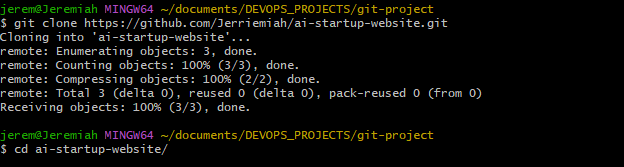
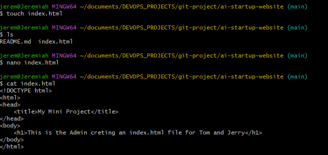
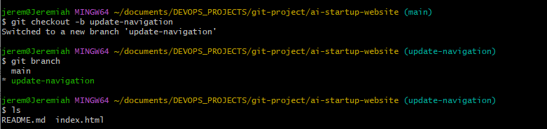
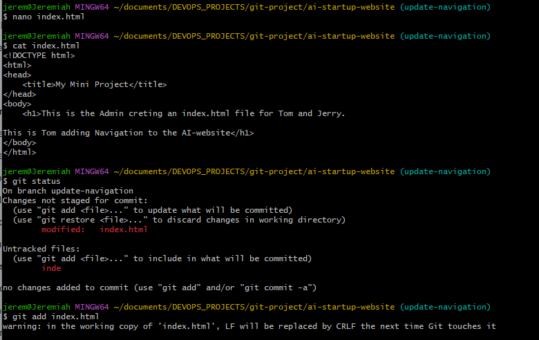
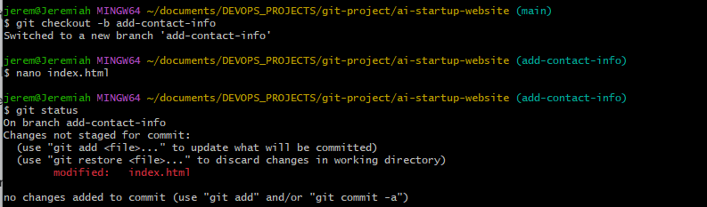
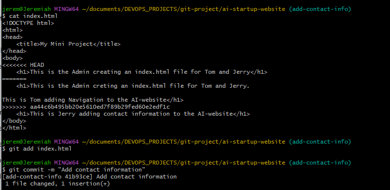
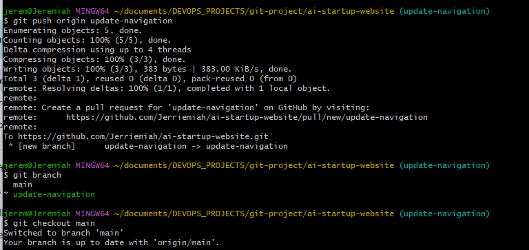
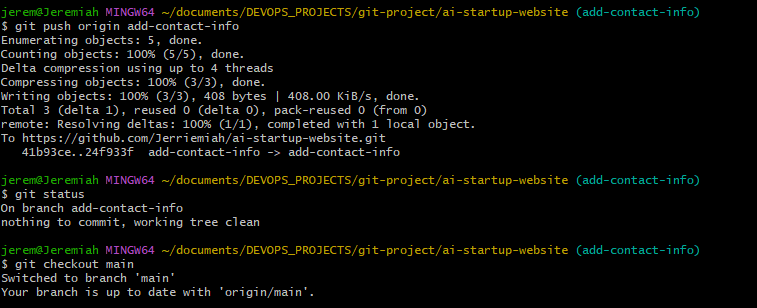

# Ai-startup-website
This is my third repository as a DevOps Engineer. This project is a step-by-step projec to simulate the workflow of Tom and Jerry using Git and GitHub

## Tom and Jerry collaborative Workflow Simulation

This project demonstrates the use of Git and GitHub to simulate a collaborative workflow between two team members, "Tom" and "Jerry," showcasing repository setup, branch creation, meaningful commits, and collaboration techniques.

## Repository Setup
The GitHub repository was created with the following details:
- Repository Name: `ai-startup-website`
- Public visibility
- A README file was included during setup.

[GitHub Repository Link](https://github.com/Jerriemiah/ai-startup-website)

## Branch Creation and Workflow
- **Branch for Tom**: Created a branch named `update-navigation`.
- **Branch for Jerry**: Created a branch named `add-contact-info`.
##

### Screenshot of Commands Used for Branch and Index Creation:

1. First was creation/clone of Repo on local machine

2. Initial commit and index.html creation

##

3. Creation of update-navigation branch for Tom

##

4. Update index.html on Tom's branch (update navigation) and  pushed to main branch

##

5. Creation of Add-contact-info branch for Jerry

##

6. Update index.html on Jerry's branch (update Add Contact info) and pushed to main branch

##

7. Merge of updates from Tom's branch (Update Navigation) to the Main branch

##

8. Merge of updates from Jerry's branch (update Navigation) with Main branch 

## Final Notes
This project was completed as part of a Git workflow simulation. The repository includes all relevant files and commits, along with a collaborative demonstration of Git commands.
