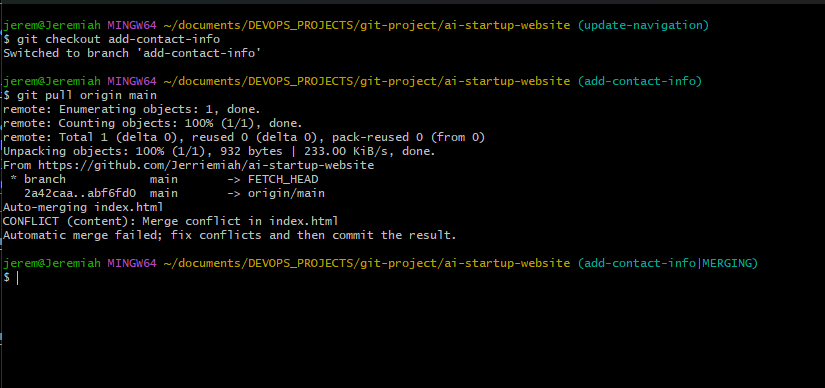

# Ai-startup-website
This is my third repository as a DevOps Engineer. This project is a step-by-step projec to simulate the workflow of Tom and Jerry using Git and GitHub

## Tom and Jerry collaborative Workflow Simulation

This project demonstrates the use of Git and GitHub to simulate a collaborative workflow between two team members, "Tom" and "Jerry," showcasing repository setup, branch creation, meaningful commits, and collaboration techniques.

## Repository Setup
The GitHub repository was created with the following details:
- Repository Name: `ai-startup-website`
- Public visibility
- A README file was included during setup.

[GitHub Repository Link](https://github.com/Jerriemiah/ai-startup-website)

## Branch Creation and Workflow
- **Branch for Tom**: Created a branch named `update-navigation`.
- **Branch for Jerry**: Created a branch named `add-contact-info`.
##

### Screenshot of Commands Used for Branch and Index Creation:

1. First was creation/clone of Repo on local machine

2. Initial commit and index.html creation

##

3. Creation of update-navigation branch for Tom

##

4. Update index.html on Tom's branch (update navigation) and  pushed to main branch

##

5. Creation of Add-contact-info branch for Jerry

##

6. Update index.html on Jerry's branch (update Add Contact info) and pushed to main branch

##

7. Merge of updates from Tom's branch (Update Navigation) to the Main branch

##

8. Merge of updates from Jerry's branch (update Navigation) with Main branch 

## Final Notes
This project was completed as part of a Git workflow simulation. The repository includes all relevant files and commits, along with a collaborative demonstration of Git commands.

##

# Tom and Jerry Collaborative Workflow Simulation - Updated Submission which includes Pull request

### Pull & Merge request for Tom

The snapshots below serves as evidence, showing the mergin pull requests and confirmation of the merges into the main branch for Tom's pull request

1. 

2. Switching to Update-Navigation branch on github

3. Clicking on "contribute" and then clicking on "Open Pull Request" to pull the request

4. Describing the pull request for Tom's update and creating the request. There were no conflicts on with the request. Reviewd and merged the pull request

5. Shows successful merging for Tom's branch with main

##
##
### Pull Request for Jerry

The snapshots below serves as evidence, showing the pull of main branch to update Jerry's Add-contact branch and to perform a pull request on GitHub
#
1. Pull command to update Add_contact branch with Main (after Tom's update)

2. Push command to push updated branch to github 

3. Creating Pull Request on GitHub

4. Successfully created pull request. No conflicts arose with base branch

5. Pull request and merge was successfull

